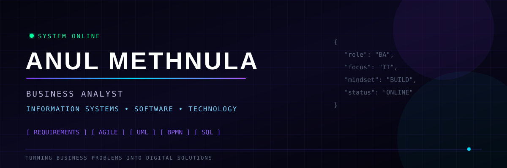

<!-- ================= HEADER ================= -->

<p align="center">
  
</p>

<p align="center">
  
</p>

<p align="center">

<a href="https://my-protofilo-five.vercel.app/">

</a>

<a href="YOUR_LINKEDIN_URL">

</a>

<a href="mailto:anulmethnula@gmail.com">

</a>

<a href="https://supuncompanies.com/">

</a>

</p>

---

<!-- ================= NAVIGATION ================= -->

<p align="center">

<a href="#about-me">About</a> •
<a href="#experience">Experience</a> •
<a href="#capabilities">Capabilities</a> •
<a href="#technology">Technology</a> •
<a href="#projects">Projects</a> •
<a href="#analytics">Analytics</a> •
<a href="#journey">Journey</a> •
<a href="#contact">Contact</a>

</p>

---

# 👋 About Me

## ANUL METHNULA

I am an **Information Systems undergraduate** focused on **Business Analysis, Project Management, Agile methodologies, and digital transformation**.

Currently, I am working as an **Intern Project Manager at Supun Group of Companies**, where I am developing practical experience in project coordination, requirements, documentation, stakeholder communication, and delivery.

I enjoy understanding business problems, converting them into clear requirements, coordinating teams, and helping deliver practical technology solutions.

### 🎯 Current Focus

- 📊 Business Analysis
- 🚀 Project Management
- 🔄 Agile & Scrum
- 📋 Requirements Gathering
- 🤝 Stakeholder Communication
- 📈 Progress Tracking & Reporting
- 📐 UML & BPMN
- 🗂️ Project Documentation
- 💡 Digital Business Solutions

---

# 💼 Experience

## Intern Project Manager
### Supun Group of Companies

**Current Role**

Working in a professional environment with a focus on:

- 📋 Project planning and coordination
- 📊 Progress tracking and reporting
- 🤝 Stakeholder communication
- 📝 Project documentation
- 🔄 Agile project practices
- 📌 Requirements understanding
- 👥 Team collaboration
- 🚀 Supporting project delivery

---

# 🧠 Capabilities

### 📊 Business Analysis

- Requirements Gathering
- Requirements Documentation
- Business Process Analysis
- Stakeholder Analysis
- Business Process Modeling
- UML
- BPMN
- SWOT Analysis
- PESTEL Analysis

### 🚀 Project Management

- Project Planning
- Task Allocation
- Progress Tracking
- Milestone Management
- Risk & Issue Tracking
- Project Documentation
- Team Coordination
- Reporting
- Scope Management

### 🔄 Agile & Scrum

- Sprint Planning
- Daily Stand-ups
- Sprint Reviews
- Retrospectives
- Backlog Management
- EPICs
- MRFs
- User Stories
- Planning Poker
- Kanban

### 🤝 Leadership

- Team Collaboration
- Stakeholder Communication
- Problem Solving
- Leadership
- Event Coordination
- Partnership Development
- Team Performance Tracking

---

# 🛠️ Technology & Tools

### Project Management

<p>


</p>

### Business Analysis & Design

<p>


</p>

### Development

<p>


</p>

### Collaboration

<p>


</p>

---

# 🚀 Projects

## 🎫 QR-Based E-Ticketing System

**HND Final Project**

`React PWA` `Flutter` `Node.js` `Firebase`

👥 **Team Size:** 4

- Coordinated the complete project lifecycle.
- Managed requirements gathering and project scope.
- Facilitated sprint planning, daily stand-ups, reviews and retrospectives.
- Tracked milestones and team progress.
- Managed project documentation.
- Produced UML diagrams and system architecture.
- Coordinated delivery of digital wallet and QR trip management features.
- Worked on dynamic fare calculation functionality.

---

## ⛽ Online Gas Delivery System

**HND Information Systems Group Project**

`Figma` `Draw.io`

👥 **Team Size:** 5

- Coordinated project tasks and timelines.
- Managed task allocation.
- Facilitated requirements workshops.
- Supported stakeholder communication.
- Translated business needs into project requirements.
- Created BPMN process diagrams.
- Designed Figma wireframes.
- Maintained project documentation.

---

## 🎟️ Queue Management System

**Agile & Scrum Coursework**

- Managed the sprint backlog.
- Coordinated daily Scrum activities.
- Facilitated Planning Poker sessions.
- Worked with EPICs and MRFs.
- Tracked team progress.
- Applied Agile and Scrum practices.
- Worked with DevOps workflow concepts.
- Maintained project documentation.

---

## 🏨 Hotel Management System

**Diploma Final Project**

`Web Technologies` `MySQL`

👥 **Team Size:** 4

- Managed project planning and task distribution.
- Coordinated project timelines.
- Managed project documentation.
- Created Use Case Diagrams.
- Created Class Diagrams.
- Created Sequence Diagrams.
- Created ER Diagrams.
- Coordinated development of admin and customer-facing systems.
- Delivered the project within the planned deadline.

---

# 📈 Analytics

<p align="center">


</p>

<p align="center">


</p>

---

# 🎓 Education

### 🎓 BSc (Hons) Information Technology for Business
**Coventry University, United Kingdom**  
*Via NIBM, Sri Lanka*

**2026 – Present**

Key Areas:

- Project Management
- IT Service & Infrastructure Management
- Data Science for Business
- Artificial Intelligence
- Cloud Security & Compliance
- Operational Research
- Digital Marketing

---

### 🎓 Higher National Diploma in Information Systems

**National Institute of Business Management – Sri Lanka**

**April 2025 – April 2026**

Key Areas:

- Business Analysis
- Agile Development & DevOps
- IT Management Practices
- Software Quality Engineering
- Innovation & Entrepreneurship
- Advanced Database Management

---

### 🎓 Diploma in Software Engineering

**National Institute of Business Management – Sri Lanka**

**September 2023 – September 2024**

Key Areas:

- Software Engineering
- Enterprise Application Development
- Object-Oriented Programming
- Computer Networks
- Web Development

---

# 🏆 Certifications

- 🏆 Managing Project Teams – Alison
- 🇬🇧 British Council English Course – Level A2
- 🎓 Certificate in Spoken English for Professional Excellence – Aquinas College
- 📚 45-Day English Course – Diplomat's Mun
- 💻 Certificate in Computer Science – NIBM

---

# 🌍 Leadership & Community

## AIESEC in NIBM

### OCVP Logistics – Elevate 26 Career Fair

- Planned and managed event logistics.
- Coordinated venue setup.
- Managed resource allocation.
- Coordinated team responsibilities.
- Supported execution of an event with **400+ delegates**.

### OCVP Partnership Development – Christmas OEM Event

- Managed partner outreach.
- Built stakeholder relationships.
- Tracked partnership deliverables.
- Supported partnership development.

### OGT B2C Team Lead – Term 26.27

- Led an attraction team.
- Set weekly targets.
- Monitored team performance.
- Reported outcomes to senior leadership.

### OC Member – Blood Donation Drive

- Supported promotional campaigns.
- Managed internal communications.
- Helped increase community participation.

---

# 🗺️ Professional Journey

```text
2022
 │
 ├── Certificate in Computer Science
 │
2023
 │
 ├── Diploma in Software Engineering
 │
2024
 │
 ├── Software Engineering Foundation
 │
2025
 │
 ├── HND in Information Systems
 ├── Business Analysis
 ├── Agile & Scrum
 └── Project Management
 │
2026
 │
 ├── BSc (Hons) IT for Business
 ├── Intern Project Manager
 └── Professional Growth
 │
 ▼
Future
 │
 └── Project Manager / Business Analyst
